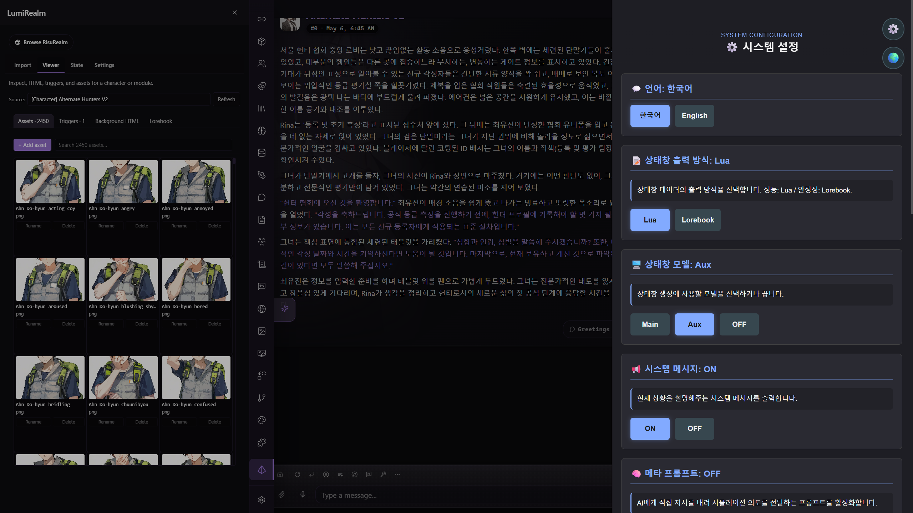
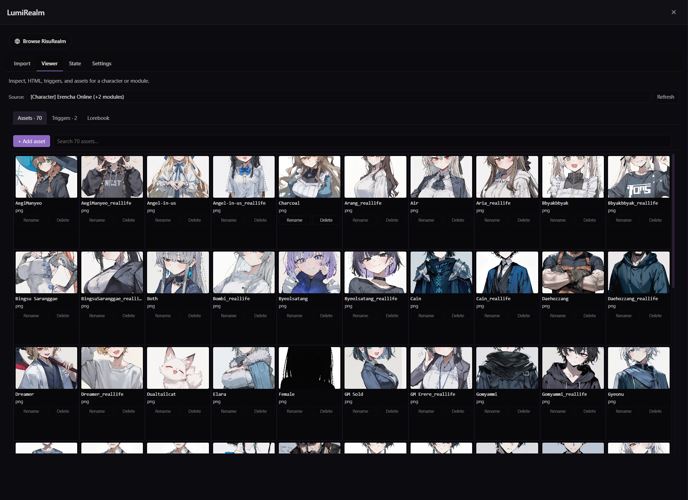
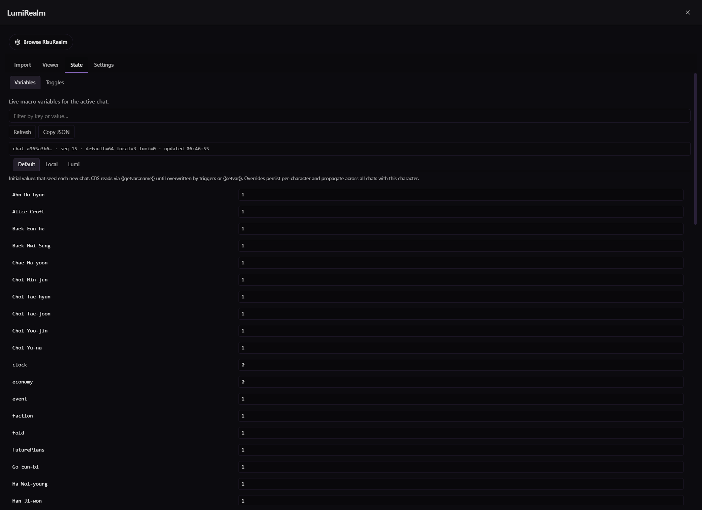

<a name="readme-top"></a>

<div align="center">


[English](../README.md) | [한국어](readme-ko_kr.md) | [日本語](readme-ja_jp.md) | [简体中文](readme-zh_cn.md) | [繁體中文](readme-zh_tw.md) | **Deutsch** | [Русский](readme-ru_ru.md)

[](../LICENSE)
[](https://github.com/prolix-oc/Lumiverse)
[](https://github.com/kwaroran/Risuai)
[](https://www.typescriptlang.org/)
[](https://bun.sh)

</div>

---

LumiRealm ist eine [Lumiverse](https://github.com/prolix-oc/Lumiverse)-Erweiterung, die [RisuAI](https://github.com/kwaroran/Risuai)-Charakterkarten, Module und Lorebooks nativ in Lumiverse ausführt. Ein integrierter RisuRealm-Bot-Browser ist enthalten.

Die vollständige Anleitung findest du im **[Wiki](https://github.com/AMousePad/LumiRealm/wiki)**.

## Screenshots

|                Beispielkarte                 |                       RisuRealm-Browser                       |
| :------------------------------------------: | :-----------------------------------------------------------: |
|  |  |

|                     Viewer                     |                    Zustand                     |
| :--------------------------------------------: | :--------------------------------------------: |
|  |  |

## Installation

LumiRealm wird als Lumiverse-Erweiterung installiert. Lumiverse muss in Version **0.9.7 oder höher (STAGING-BRANCH)** vorliegen.

1. Öffne deine Lumiverse-Instanz.
2. Gehe zu **Settings → Extensions** und füge hinzu:

   ```txt
   https://github.com/AMousePad/LumiRealm
   ```
3. Aktiviere zuerst alle Berechtigungen. LumiRealm benötigt sie alle, um zu funktionieren. [Warum?](https://github.com/AMousePad/LumiRealm/wiki/Architecture)
4. Aktiviere die Erweiterung. Der **LumiRealm**-Tab erscheint in der Seitenleiste.

## Community

- **[Discord](https://github.com/AMousePad/LumiRealm/wiki/Discord)**: Im Lumiverse-Server!
- **[Issues](https://github.com/AMousePad/LumiRealm/issues)**: Fehlerberichte und Funktionswünsche.
- **[Wiki](https://github.com/AMousePad/LumiRealm/wiki)**: Benutzerhandbuch und Architektur-Tiefgang.

## Lizenz

**GPL-3.0-or-later.** LumiRealm ist ein abgeleitetes Werk von [RisuAI](https://github.com/kwaroran/Risuai) (GPL-3.0, © 2024 Kwaroran). Komplette Module (Lua-Bridge-Prelude, sämtliche CBS-Handler, `processScriptFull`-Portierung, Modul- und Toggle-DSL-Parser, Lorebook-Decorator-Parser) sind direkte Portierungen. Risus kompiliertes CSS-Bundle wird unverändert mitgeliefert.

<p align="right">(<a href="#readme-top">nach oben</a>)</p>
